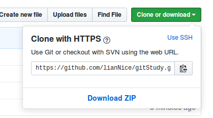
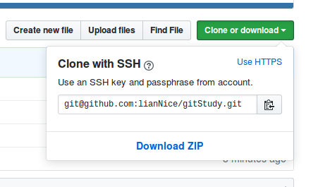

## 免密登录
每次提交文件到远程仓库都需要输入密码，是因为使用的是http的克隆方式 
#### http方式克隆

### 更改为ssh方式克隆

#### 查看克隆方式
'''
git remote -v  
'''
出现类似以下的信息： 
origin 'https://github.com/xxx/.git'(fetch) 
origin 'https://github.com/xxx/.git'(push) 
说明当前是http方式 

#### 更改为ssh方式
'''
git remote rm origin  ## 移除https方式 
git remote add origin (ssh 方式的地址，图二中的) 
git remote -v (查看是否更改成功) 
git push origin master <重新提交>

'''

